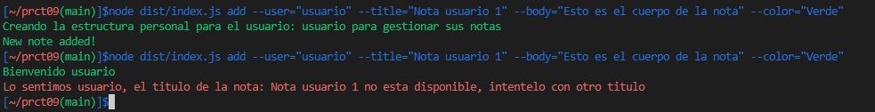
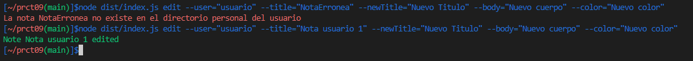
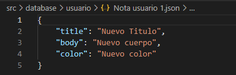
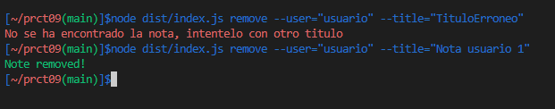
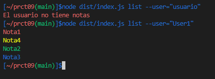
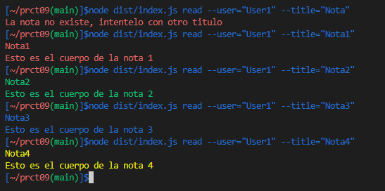

# Práctica 9 - Aplicación de procesamiento de notas de texto
## _Desarrollo de Sistemas Informáticos_

[](https://coveralls.io/github/ULL-ESIT-INF-DSI-2122/ull-esit-inf-dsi-21-22-prct09-filesystem-notes-app-alu0100974652?branch=main)

[](https://github.com/ULL-ESIT-INF-DSI-2122/ull-esit-inf-dsi-21-22-prct09-filesystem-notes-app-alu0100974652/actions/workflows/node.js.yml)

[](https://github.com/ULL-ESIT-INF-DSI-2122/ull-esit-inf-dsi-21-22-prct09-filesystem-notes-app-alu0100974652/actions/workflows/tests.js.yml)

[](https://github.com/ULL-ESIT-INF-DSI-2122/ull-esit-inf-dsi-21-22-prct09-filesystem-notes-app-alu0100974652/actions/workflows/sonarcloud.yml)

En esta práctica, tendrá que implementar una aplicación de procesamiento de notas de texto. En concreto, la misma permitirá añadir, modificar, eliminar, listar y leer notas de un usuario concreto. Las notas se almacenarán como ficheros JSON en el sistema de ficheros de la máquina que ejecute la aplicación. Además, solo se podrá interactuar con la aplicación desde la línea de comandos.

## Planteamiento
Para resolver esta práctica se plantea lo siguiente:
- Class Note: una clase nota que implemente las funcionalidades de una nota, como son titulos, cuerpo y color.
- Class ManagerNote: una clase gestor de notas que implementará las principales funcionalidades de gestión de notas (añadir, eliminar, editar, mostrar, etc, ...) de un determinado usuario.
- index.js: en este archivo se realizará el procesamiento de la línea de comandos con el uso del paquete [yargs](https://www.npmjs.com/package/yargs).

## Class Note
En esta clase se representa el objeto Nota, esta tendrá los siguientes atributos:
```typescript
    /**
     * Constructor
     * @param title titulo de la nota
     * @param body cuerpo de la nota
     * @param color color de la nota
     */
    constructor(private title: string, private body: string, private color: string) {}
```
Los getters y setters de la clase:
```typescript
    /**
     * GetterTitle
     * @returns devuelve el titulo de la nota
     */
    getTitle() {
        return this.title
    }    
    /**
     * GetterBody
     * @returns devuelve el cuerpo de la nota
     */
    getBody() {
        return this.body
    }
    /**
     * GetterColor
     * @returns devuelve el color de la nota
     */
    getColor() {
        return this.color
    }
    /**
     * SetterTitle
     * @param newTitle nuevo titulo de la nota
     */
    setTitle(newTitle: string) {
        this.title = newTitle
    }    
    /**
     * SetterBody
     * @param newBody nuevo cuerpo de la nota
     */
    setBody(newBody: string) {
        this.body = newBody
    }
    /**
     * SetterColor
     * @param newColor nuevo color de la nota
     */
    setColor(newColor: string) {
        this.color = newColor
    }
```
De esta manera sólo nos queda mostrar la información con un color, para ello usaremos el paquete [chalk](https://www.npmjs.com/package/chalk)
Para ello crearemos dos métodos:
- showTitle: mostrará el título de la nota con su respectivo color
- showBody: mostrará el cuerpo de la nota con su respectivo color
```typescript
    /**
     * Muestra el titulo de la nota con su respectivo color
     * @returns devuelve un console.log a modo de print
     */
    showTitle() {
        switch(this.color) {
            case 'Rojo':
                return chalk.red(this.title)
            case 'Verde':
                return chalk.green(this.title)
            case 'Azul':
                return chalk.blue(this.title)
            case 'Amarillo':
                return chalk.yellow(this.title)
            default:
                return chalk.red('Color erroneo')
        }
    }
    /**
     * Muestra el cuerpo de la nota con su respectivo color
     * @returns devuelve un console.log a modo de print
     */
    showBody() {
        switch(this.color) {
            case 'Rojo':
                return chalk.red(this.body)
            case 'Verde':
                return chalk.green(this.body)
            case 'Azul':
                return chalk.blue(this.body)
            case 'Amarillo':
                return chalk.yellow(this.body)
            default:
                return chalk.red('Color erroneo')
        }
    }
```
Los tests implementados de esta clase están alojados [aqui](./tests/note.spec.ts) pero para tenerlo de manera más visual se muestra el siguiente código fuente junto a una imagen.
```typescript
const note1 = new Note('Nota1', 'Esto es el cuerpo de la nota 1', 'Rojo')
const note2 = new Note('Nota2', 'Esto es el cuerpo de la nota 2', 'Verde')
const note3 = new Note('Nota3', 'Esto es el cuerpo de la nota 3', 'Azul')
const note4 = new Note('Nota4', 'Esto es el cuerpo de la nota 4', 'Amarillo')
const note5 = new Note('', '', '')

console.log(note1.showTitle())
console.log(note1.showBody())
console.log(note2.showTitle())
console.log(note2.showBody())
console.log(note3.showTitle())
console.log(note3.showBody())
console.log(note4.showTitle())
console.log(note4.showBody())
console.log(note5.showTitle())
console.log(note5.showBody())
```


## Class ManagerNote

En la clase ManagerNote tendremos los métodos para que el usuario que llame a los mismos, pueda manipular las notas con sus distintos métodos utilizando el módulo *fs* para su gestión. De esta manera tendremos el siguinte constructor:
```typescript
    /**
     * Constructor
     * @param user usuario que implementará los métodos
     */
    constructor(private user: string) {}
```
Y ahora pasaremos a mostrar los métodos:
- addNote: añade una nueva nota en el directorio personal del usuario en las notas.
- editNote: edita una nota existente, cambiando titulo, cuerpo y color.
- removeNote: elimina una nota.
- listNotes: lista las notas del directorio personal del usuario.
- readNotes: lee una nota existente del directorio personal del usuario.

### addNote
La implementación del método será la siguiente:
```typescript
    /**
     * Agrega un nueva nota al directorio de notas del usuario
     * @param addNoteToUser nota a agregar
     */
    addNote(addNoteToUser: Note) {
        const rute: string = './src/database/' + this.user
        const fileRute: string =  './src/database/' + this.user + '/' + addNoteToUser.getTitle() + '.json'
        if(fs.existsSync(rute)) {
            console.log(chalk.green(`Bienvenido ${this.user}`))
            if(fs.existsSync(fileRute)) {
                console.log(chalk.red(`Lo sentimos ${this.user}, el titulo de la nota: ${addNoteToUser.getTitle()} no esta disponible, intentelo con otro titulo`))
            } else {
                fs.writeFileSync(fileRute, `{\n\t"title": "${addNoteToUser.getTitle()}",\n\t"body": "${addNoteToUser.getBody()}",\n\t"color": "${addNoteToUser.getColor()}"\n}`)
                console.log(chalk.green('New note added!'))
            }
        } else {
            console.log(chalk.green(`Creando la estructura personal para el usuario: ${this.user} para gestionar sus notas `))
            fs.mkdirSync(rute)
            fs.writeFileSync(fileRute, `{\n\t"title": "${addNoteToUser.getTitle()}",\n\t"body": "${addNoteToUser.getBody()}",\n\t"color": "${addNoteToUser.getColor()}"\n}`)
            console.log(chalk.green('New note added!'))
        }
    }
```
El método crea dos rutas, una ruta de directorio personal del usuario y una ruta de directorio del fichero con el título de la nota que se quiere agregar. Si no existe creará el directorio personal del usuario y añadirá la nota en la ruta correspondiente, en caso de que exista el directorio personal, se muestra un mensaje de bienvenida al usuario y añade la nota. En caso de que exista ya una nota con el mismo título, se mostrará un mensaje de error en color rojo.



### editNote
La implementación del método será la siguiente:
```typescript
    editNote(title: string, newtitle: string, newBody: string, newColor: string) {
        const fileRute: string = './src/database/' + this.user + '/' + title + '.json'
        if(fs.existsSync(fileRute)) {
            fs.writeFileSync(fileRute, `{\n\t"title": "${newtitle}",\n\t"body": "${newBody}",\n\t"color": "${newColor}"\n}`)
            console.log(chalk.green(`Note ${title} edited`))
        } else {
            console.log(chalk.red(`La nota ${title} no existe en el directorio personal del ${this.user}`))
        }
    }
```
El método se basa en buscar la ruta de la nota y modificar su contenido a través del método *writeFileSync* del módulo *fs*, en caso de que la modifique muestra un mensaje verde en la consola y, en caso de que no se encuentre el directorio de la nota mostrará un mensaje en rojo.



### removeNote
El método es similar a editNote, se basa en buscar la ruta de la nota y eliminarla con el método *rmSync* del módulo *fs*.
```typescript
    removeNote(title: string) {
        const fileRute: string = './src/database/' + this.user + '/' + title + '.json';
        if(fs.existsSync(fileRute)) {
            fs.rmSync(fileRute)
            console.log(chalk.green('Note removed!'))
        } else {
            console.log(chalk.red('No se ha encontrado la nota, intentelo con otro titulo'))            
        }
    }
```


### listNotes
El método se basa en, a través de la ruta personal del usuario, ir insertando cada una de las direcciones de las notas del mismo en un array llamado **notesA**. En caso de que el tamaño del array sea 0, eso nos querrá decir que el usuario no tiene notas en su directorio personal, en el caso contrario, recorreremos cada uno de los elementos/direcciones del array. Una vez estemos accediendo a cada uno de los elementos del array, realizaremos un JSON.parse, del contenido de las notas, para poder analizar las cadenas de texto como formato JSON y mostrar el título de cada una de las notas.
```typescript
    listNotes() {
        const rute: string = './src/database/' + this.user
        if(fs.existsSync(rute)) {
            const notesA: string[] = []
            fs.readdirSync(rute).forEach((notes) => {
                notesA.push(notes)
            })
            if(notesA.length == 0) {
                console.log(chalk.red("El usuario no tiene notas"))
            } else {
                notesA.forEach((note) => {
                    fs.readFile(`./src/database/${this.user}/${note}`, (err, data) => {
                        if(err) {
                            console.log(chalk.red('Read error'))
                        } else {
                            const notesJson = JSON.parse(data.toString())
                            switch(notesJson.color) {
                                case 'Rojo':
                                    console.log(chalk.red(notesJson.title))
                                    break;
                                case 'Verde':
                                    console.log(chalk.green(notesJson.title))
                                    break;
                                case 'Azul':
                                    console.log(chalk.blue(notesJson.title))
                                    break;
                                case 'Amarillo':
                                    console.log(chalk.yellow(notesJson.title))
                                    break;
                            }
                        }
                    })
                })
            }
        } else {
            console.log(chalk.red('No existe el usuario'))
        }
    }
```


### readNotes
Similar al método **editNote** y **listNotes**, buscaremos por el título de la nota y realizaremos un JSON.parse para poder mostrar su contenido.
```typescript
    readNotes(titleRead: string) {
        const fileRute: string = './src/database/' + this.user + '/' + titleRead + '.json'
        if(fs.existsSync(fileRute)) {
            fs.readFile(fileRute, (err, data) => {
                if(err) {
                    console.log(chalk.red('Read Error'))
                } else {
                    const notesJson = JSON.parse(data.toString())
                    switch(notesJson.color) {
                        case 'Rojo':
                            console.log(chalk.red(`${notesJson.title}\n${notesJson.body}`))
                            break;
                        case 'Verde':
                            console.log(chalk.green(`${notesJson.title}\n${notesJson.body}`))
                            break;
                        case 'Azul':
                            console.log(chalk.blue(`${notesJson.title}\n${notesJson.body}`))
                            break;
                        case 'Amarillo':
                            console.log(chalk.yellow(`${notesJson.title}\n${notesJson.body}`))
                            break;
                    }
                    
                }
            })
        } else {
            console.log(chalk.red('La nota no existe, intentelo con otro titulo'))
        }
    }
```



Los tests implementados de esta clase están alojados [aqui](./tests/managerNote.spec.ts)

### index
Se trata del programa principal, el cual manipulará a través de la línea de comandos cada una de las opciones implementadas con anterioridad, para ello se utilizará el módulo [*yargs*](https://www.npmjs.com/package/yargs), el cual nos permitirá crear nuestros propios comandos de línea en node.js.
Como las opciones son similares entre si y el único cambio es como se llama al método de la clase ManagerNote, se comentará sólo una.
```typescript
yargs.command({
  command: 'add',
  describe: 'Add new note',
  builder: {
      user: {
          describe: 'User Name',
          demandOption: true,
          type: 'string',
      },
      title: {
          describe: 'Note Title',
          demandOption: true,
          type: 'string',
      },
      body: {
          describe: 'Note Body',
          demandOption: true,
          type: 'string',
      },
      color: {
          describe: 'Note Color',
          demandOption: true,
          type: 'string',
      },
  },
```
Esta primera parte describe el comando principal **add** la cual lleva consigo una serie de parámetros que son de carácter obligatorio (demandOption: true), y el tipo de dato que se espera.
```typescript
  handler(argv) {
      if(typeof argv.user === 'string' && typeof argv.title === 'string' && typeof argv.body === 'string' && typeof argv.color === 'string') {
          const newNote = new Note(argv.title, argv.body, argv.color)
          const managerNote = new ManagerNote(argv.user)
          managerNote.addNote(newNote)
      } else {
          console.log(chalk.red('Argumentos inválidos'))
      }
  }
})
```
Esta última parte comprueba el tipo de dato que se pasa como parámetro y en caso de que sean erróneos mandará un mensaje de error. En el caso contrario se crean el objeto Note y managerNote para su gestión.