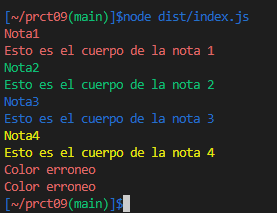

# Práctica 9 - Aplicación de procesamiento de notas de texto
## _Desarrollo de Sistemas Informáticos_

[](https://coveralls.io/github/ULL-ESIT-INF-DSI-2122/ull-esit-inf-dsi-21-22-prct09-filesystem-notes-app-alu0100974652?branch=main)

[](https://github.com/ULL-ESIT-INF-DSI-2122/ull-esit-inf-dsi-21-22-prct09-filesystem-notes-app-alu0100974652/actions/workflows/node.js.yml)

[](https://github.com/ULL-ESIT-INF-DSI-2122/ull-esit-inf-dsi-21-22-prct09-filesystem-notes-app-alu0100974652/actions/workflows/tests.js.yml)

En esta práctica, tendrá que implementar una aplicación de procesamiento de notas de texto. En concreto, la misma permitirá añadir, modificar, eliminar, listar y leer notas de un usuario concreto. Las notas se almacenarán como ficheros JSON en el sistema de ficheros de la máquina que ejecute la aplicación. Además, solo se podrá interactuar con la aplicación desde la línea de comandos.

### Planteamiento
Para resolver esta práctica se plantea lo siguiente:
- Class Note: una clase nota que implemente las funcionalidades de una nota, como son titulos, cuerpo y color.
- Class ManagerNote: una clase gestor de notas que implementará las principales funcionalidades de gestión de notas (añadir, eliminar, editar, mostrar, etc, ...) de un determinado usuario.
- index.js: en este archivo se realizará el procesamiento de la línea de comandos con el uso del paquete [yargs](https://www.npmjs.com/package/yargs).

### Class Note
En esta clase se representa el objeto Nota, esta tendrá los siguientes atributos:
```typescript
    /**
     * Constructor
     * @param title titulo de la nota
     * @param body cuerpo de la nota
     * @param color color de la nota
     */
    constructor(private title: string, private body: string, private color: string) {}
```
Los getters y setters de la clase:
```typescript
    /**
     * GetterTitle
     * @returns devuelve el titulo de la nota
     */
    getTitle() {
        return this.title
    }    
    /**
     * GetterBody
     * @returns devuelve el cuerpo de la nota
     */
    getBody() {
        return this.body
    }
    /**
     * GetterColor
     * @returns devuelve el color de la nota
     */
    getColor() {
        return this.color
    }
    /**
     * SetterTitle
     * @param newTitle nuevo titulo de la nota
     */
    setTitle(newTitle: string) {
        this.title = newTitle
    }    
    /**
     * SetterBody
     * @param newBody nuevo cuerpo de la nota
     */
    setBody(newBody: string) {
        this.body = newBody
    }
    /**
     * SetterColor
     * @param newColor nuevo color de la nota
     */
    setColor(newColor: string) {
        this.color = newColor
    }
```
De esta manera sólo nos queda mostrar la información con un color, para ello usaremos el paquete [chalk](https://www.npmjs.com/package/chalk)
Para ello crearemos dos métodos:
- showTitle: mostrará el título de la nota con su respectivo color
- showBody: mostrará el cuerpo de la nota con su respectivo color
```typescript
    /**
     * Muestra el titulo de la nota con su respectivo color
     * @returns devuelve un console.log a modo de print
     */
    showTitle() {
        switch(this.color) {
            case 'Rojo':
                return chalk.red(this.title)
            case 'Verde':
                return chalk.green(this.title)
            case 'Azul':
                return chalk.blue(this.title)
            case 'Amarillo':
                return chalk.yellow(this.title)
            default:
                return chalk.red('Color erroneo')
        }
    }
    /**
     * Muestra el cuerpo de la nota con su respectivo color
     * @returns devuelve un console.log a modo de print
     */
    showBody() {
        switch(this.color) {
            case 'Rojo':
                return chalk.red(this.body)
            case 'Verde':
                return chalk.green(this.body)
            case 'Azul':
                return chalk.blue(this.body)
            case 'Amarillo':
                return chalk.yellow(this.body)
            default:
                return chalk.red('Color erroneo')
        }
    }
```
Los tests implementados de esta clase están alojados [aqui](./tests/note.spec.ts) pero para tenerlo de manera más visual se muestra el siguiente código fuente junto a una imagen.
```typescript
const note1 = new Note('Nota1', 'Esto es el cuerpo de la nota 1', 'Rojo')
const note2 = new Note('Nota2', 'Esto es el cuerpo de la nota 2', 'Verde')
const note3 = new Note('Nota3', 'Esto es el cuerpo de la nota 3', 'Azul')
const note4 = new Note('Nota4', 'Esto es el cuerpo de la nota 4', 'Amarillo')
const note5 = new Note('', '', '')

console.log(note1.showTitle())
console.log(note1.showBody())
console.log(note2.showTitle())
console.log(note2.showBody())
console.log(note3.showTitle())
console.log(note3.showBody())
console.log(note4.showTitle())
console.log(note4.showBody())
console.log(note5.showTitle())
console.log(note5.showBody())
```


### Class ManagerNote